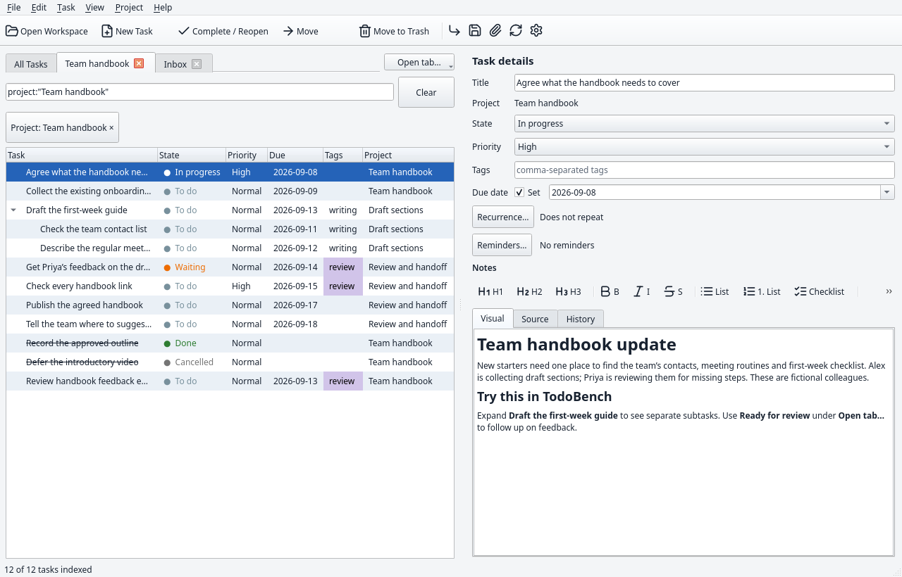
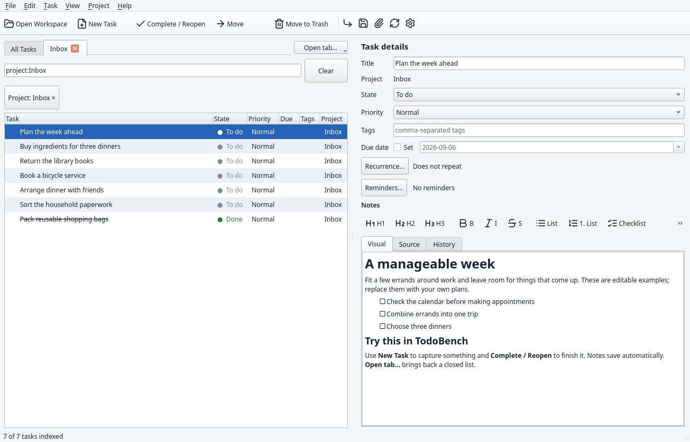
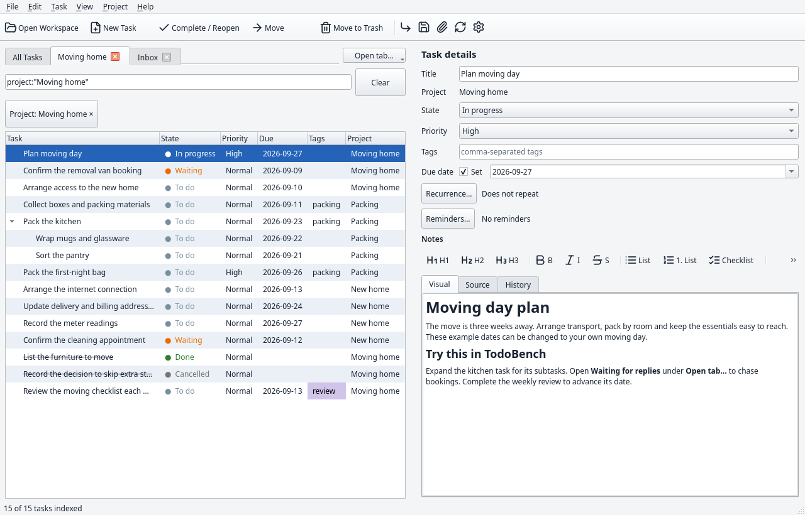
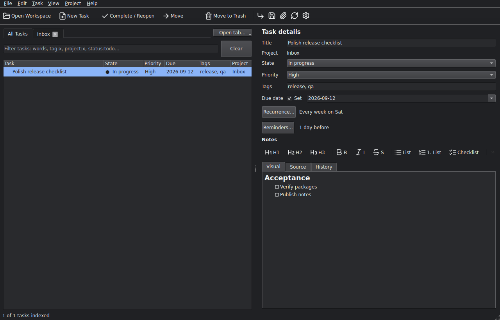
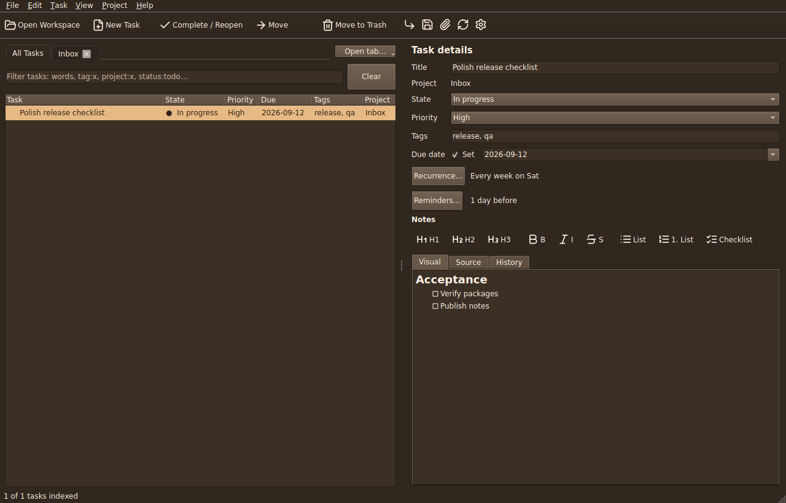

<p align="center">
  
</p>

<h1 align="center">TodoBench</h1>

<p align="center">
  <strong>A clear place for your tasks. An ordinary folder for your work.</strong><br>
  A native desktop task manager with projects, subtasks, Markdown notes, and portable workspaces.<br>
  Your tasks and attachments stay in files you can read, edit, and take with you.
</p>

<p align="center">
  <a href="https://github.com/Alex9001/TodoBench/actions/workflows/ci.yml"></a>
  <a href="https://github.com/Alex9001/TodoBench/releases/latest"></a>
  <a href="https://github.com/Alex9001/TodoBench/releases"></a>
  <a href="LICENSE"></a>
  <a href="#download"></a>
</p>

<p align="center">
  <a href="https://alex9001.github.io/TodoBench/">Website</a> ·
  <a href="#download">Download</a> ·
  <a href="#quick-start">Quick start</a> ·
  <a href="docs/workspace-format-v1.md">Workspace format</a> ·
  <a href="https://github.com/Alex9001/TodoBench/issues">Issues</a>
</p>



<p align="center"><sub>The actual desktop app, showing the included Team project sample. Sample people and projects are fictional.</sub></p>

## Keep the task and its context together

TodoBench keeps your project tabs and task list beside the details of the selected task. Organize a household job, plan a move, or track a project through drafting, review, and handoff. Notes and attachments stay with the work they describe.

| What you need | What TodoBench gives you |
| --- | --- |
| See the next step | Nested projects and subtasks, five task states, priorities, tags, and due dates |
| Keep the details nearby | Markdown notes with **Visual**, **Source**, and **History** views, checklists, links, and attachments |
| Focus on a slice of work | Project tabs, saved views, and filters that combine text, tags, project names, and states |
| Remember recurring work | Date-only scheduling, calendar-based or after-completion recurrence, and reminders |
| Make the app comfortable | Eleven appearance choices, custom colors, and Browser or Total Commander keyboard presets |
| Keep control of your data | Ordinary Markdown and JSON files, complete `.7z` snapshots, history, trash, and conflict recovery |

## Download

**[TodoBench v0.1.1](https://github.com/Alex9001/TodoBench/releases/tag/v0.1.1)** is available for all four targets below. Runtime libraries are bundled; you do not need a separate Qt installation.

| Platform | Install | Portable |
| --- | --- | --- |
| Linux x86_64 | [AppImage](https://github.com/Alex9001/TodoBench/releases/download/v0.1.1/TodoBench-0.1.1-linux-x86_64.AppImage) | [Bundled tar.gz](https://github.com/Alex9001/TodoBench/releases/download/v0.1.1/TodoBench-0.1.1-linux-x86_64.tar.gz) |
| Windows x64 | [Per-user installer](https://github.com/Alex9001/TodoBench/releases/download/v0.1.1/TodoBench-0.1.1-windows-x64-setup.exe) | [ZIP](https://github.com/Alex9001/TodoBench/releases/download/v0.1.1/TodoBench-0.1.1-windows-x64.zip) |
| macOS Apple Silicon | [DMG](https://github.com/Alex9001/TodoBench/releases/download/v0.1.1/TodoBench-0.1.1-macos-arm64.dmg) | [Application ZIP](https://github.com/Alex9001/TodoBench/releases/download/v0.1.1/TodoBench-0.1.1-macos-arm64.zip) |
| macOS Intel | [DMG](https://github.com/Alex9001/TodoBench/releases/download/v0.1.1/TodoBench-0.1.1-macos-x86_64.dmg) | [Application ZIP](https://github.com/Alex9001/TodoBench/releases/download/v0.1.1/TodoBench-0.1.1-macos-x86_64.zip) |

Linux packages target Ubuntu 24.04 or compatible newer systems. Make the AppImage executable before opening it; without FUSE, use `APPIMAGE_EXTRACT_AND_RUN=1`. Windows packages have no publisher certificate. macOS apps are ad-hoc signed, without notarization. See the [installation guide](docs/packaging.md#packages-and-unsigned-installation) for first-launch steps.

Every release includes [SHA-256 checksums](https://github.com/Alex9001/TodoBench/releases/download/v0.1.1/SHA256SUMS), the exact application source, dependency source, and build instructions. [All releases →](https://github.com/Alex9001/TodoBench/releases)

## Quick start

1. **Open TodoBench.** The first-launch guide can create a workspace or open an existing folder.
2. **Choose a starting point.** Start with an empty Inbox, everyday to-dos, a move, a team project, a website project, or the guided feature tour.
3. **Choose an empty folder, theme, and keyboard preset.** Preview the sample before creating it. Files go directly into your chosen folder.
4. **Make it yours.** Add a task, expand its subtasks, write notes, or use **Open tab…** to choose a project or saved view.

TodoBench reopens your last workspace, tabs, and filters on launch. Return to **Help → Getting started** whenever you need the guide. Sample dates are relative to creation day and sample reminders are off.

[Read the getting-started guide →](docs/getting-started.md)

<table>
  <tr><th width="50%">Everyday to-dos</th><th width="50%">Move into a new home</th></tr>
  <tr>
    <td><a href="site/assets/screenshots/everyday.png"></a></td>
    <td><a href="site/assets/screenshots/home.png"></a></td>
  </tr>
</table>

## Workspaces you can read and take with you

```text
my-workspace/
├── settings.json
└── projects/
    └── inbox/
        ├── project.md
        └── tasks/
            └── plan-the-week/
                ├── task.md
                └── assets/
                    └── brief.pdf
```

Task and project metadata live in YAML front matter; notes are Markdown. Settings are JSON. Stable UUIDs identify tasks and projects, folders determine project membership, and relative links keep attachments portable.

- **Edit with other tools.** Metadata edits preserve note bodies byte-for-byte and retain unknown fields, including nested extensions. Unsupported Markdown remains editable in Source.
- **Keep competing edits.** Clean external changes reload; stale saves retain competing versions for recovery. Opening or inspecting a file does not rewrite it.
- **Export the whole workspace.** Standard `.7z` snapshots include attachments, unknown files, history, trash, and recovery material. Transient locks are excluded.
- **Build another client.** The [workspace v1 specification](docs/workspace-format-v1.md), [representative fixtures](docs/fixtures/workspace-v1), and [independent reference test](scripts/reference-interop.py) define the public interoperability interface.

TodoBench works locally without a hosted account. Automatic synchronization and merging are outside this release; see the specification before coordinating external writers.

## An appearance that suits your desk

Choose **View → Appearance** for System, Light, Dark, Midnight, Blue, Green, Brown, Amber, Purple, Rose, or Paper. Each preset can keep its own custom colors. Light has a white editor; named presets use consistent Qt Fusion controls.

<table>
  <tr><th width="50%">Dark</th><th width="50%">Brown</th></tr>
  <tr>
    <td><a href="site/assets/screenshots/dark.png"></a></td>
    <td><a href="site/assets/screenshots/brown.png"></a></td>
  </tr>
</table>

[Preview themes on the website →](https://alex9001.github.io/TodoBench/#appearance)

## Build from source

TodoBench uses **C++20, Qt 6.8+** (release SDK: 6.8.3), CMake 3.24+, Ninja, yaml-cpp, and libarchive. Qt is supplied separately from the vcpkg manifest. Python 3.10+, the development requirements, and standalone 7-Zip are needed for validation.

```bash
python -m pip install -r requirements-dev.txt
cmake --preset dev
cmake --build --preset dev --parallel
ctest --preset dev --output-on-failure
python scripts/check-quality.py --build-dir build/dev
```

Provide your Qt and dependency paths as described in the [build guide](docs/packaging.md#build-from-source). Windows uses MSVC and the pinned vcpkg baseline. Start the development build with `./build/dev/TodoBench`, optionally followed by a workspace path. The `asan` and `release` presets are also available.

CI runs 17 native suites across Linux, Windows, Intel macOS, and Apple Silicon macOS, plus Linux sanitizers, complexity checks, and workflow lint. Release gates verify packaged startup, dependencies, workspace round trips, and downloaded checksums before publication.

## Documentation and contributing

| Guide | Covers |
| --- | --- |
| [Getting started](docs/getting-started.md) | Samples, first launch, project tabs, filters, and custom colors |
| [Installation and packaging](docs/packaging.md) | Platform requirements, unsigned installation, source builds, and release verification |
| [Workspace format v1](docs/workspace-format-v1.md) | Persisted fields, safe external edits, attachment paths, and archive rules |
| [Development](docs/development.md) | Tooling, native tests, sanitizers, and complexity gates |
| [Contributing](CONTRIBUTING.md) | Bug reports, changes, and validation |
| [Website maintenance](docs/website.md) | Static site build, screenshots, and GitHub Pages deployment |

Found a problem or have an idea? [Open an issue](https://github.com/Alex9001/TodoBench/issues). Please include your platform, TodoBench version, and steps to reproduce a bug.

## License

Copyright © 2026 Aleksandr Oreshkin. Free software under **GPL-3.0-or-later**. You may redistribute and modify it under version 3 of the GNU General Public License, or any later version. It comes without any warranty.

See [LICENSE](LICENSE) and [third-party notices](packaging/THIRD_PARTY_NOTICES.md), including Qt and the bundled Lucide icons. Corresponding source and build instructions accompany release binaries.
